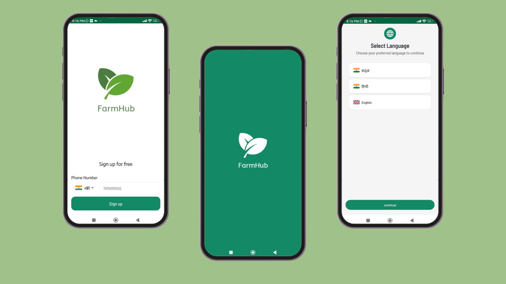
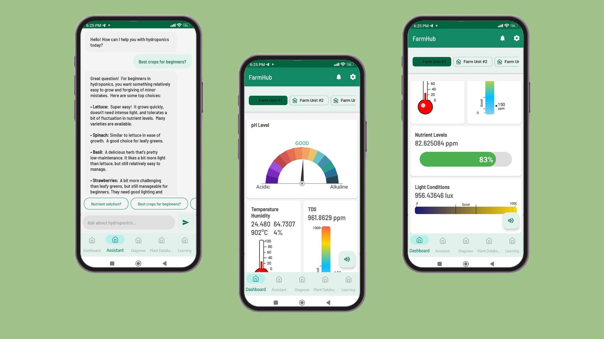
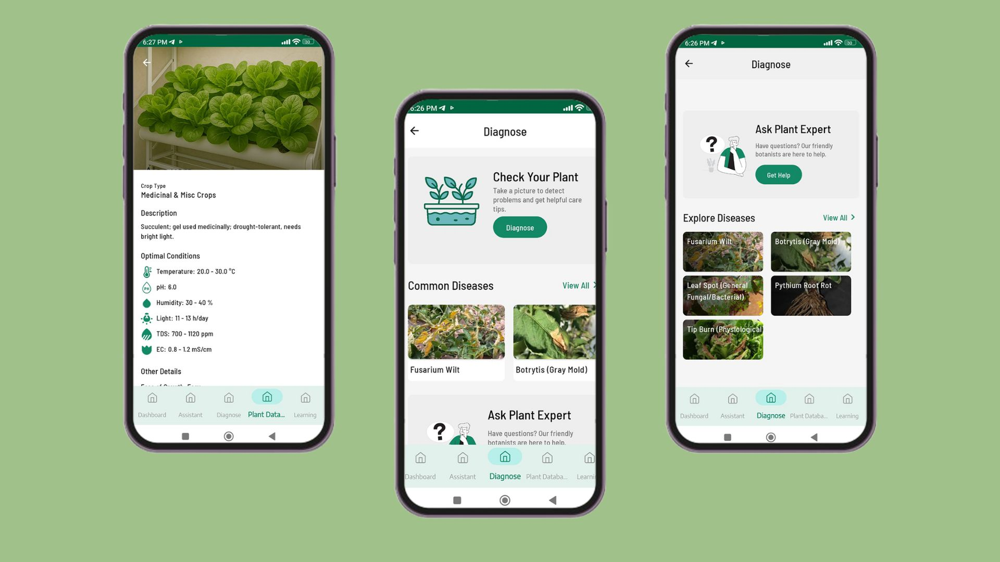
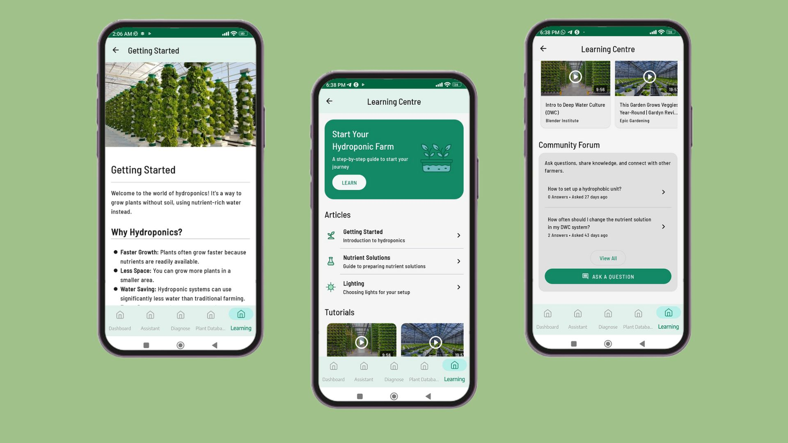

# **FarmHub App** 🌱📱 *Your Smart Hydroponics Companion*

Welcome to **FarmHub**! 🎉🌿 This all-in-one app is designed to empower hydroponic farmers, from beginners to experts, by providing powerful tools to monitor, manage, and learn. With its intuitive design and robust features, FarmHub makes hydroponic farming simpler and more productive. 💧✨

---

## **🌟 Features 🌟**

### 1. **Onboarding & Setup** 🚀📲

Kickstart your smart farming journey with a seamless setup process.

- **Splash Screen:** A clean and welcoming start to your FarmHub experience. 💧
- **Language Selection:** Choose the language that works best for you. 🌐
- **Secure Sign-Up:** Quickly and securely create your account using your phone number and OTP verification, powered by Firebase. 🔑👤

---

### 2. **Smart Hub: Dashboard & AI Assistant** 📊🤖

Your central command center for real-time monitoring and expert advice, all in one place.

- **Real-Time Dashboard:** Get live updates on crucial parameters like pH, Temperature, Humidity, TDS, Nutrient Levels, and Light Conditions using intuitive gauges and graphs. 📈
- **Multi-Farm Management:** Add and manage multiple farm units from a single screen. ➕🌾
- **Integrated AI Assistant:** Get instant answers to your hydroponics questions from our AI-powered agronomist, powered by Gemini. From simple tips to complex solutions, help is always available. 💡🧠

---

### 3. **Health Diagnosis & Crop Recommendations** 🩺🌿

Smart tools to keep your crops healthy and help you decide what to grow next. ✨

- **Plant Disease Detection:** Upload a photo of your plant, and our AI will detect potential diseases, helping you to take timely action. 📸🦠
- **Personalized Crop Recommendations:** Receive suggestions on what to plant based on your location, temperature, available space, and more. 🌱📍
- **Comprehensive Plant Database:** Browse a rich database of crops with detailed information on their optimal growing conditions (Temperature, pH, Humidity, etc.). 📚

---

### 4. **Learning & Community** 📚🤝

Learn from experts and connect with a community of fellow growers. 🌍

- **Learning Center:** Access a rich library of articles and video tutorials to expand your hydroponics knowledge. 📖🎬
- **Community Forum:** Ask questions, share your experiences, and connect with other farmers. Get advice and help others on their growing journey. 🗣️💬

---

## **🛠️ Technology Stack 🛠️**

- **Mobile Development:** Kotlin & XML
- **Backend & Real-time Data:** Firebase (Realtime Database, Firestore, Authentication)
- **AI Assistant:** Gemini

---

## **📬 Contact Us 📬**

Have questions or need assistance? We’re here to help! 🤗💬

- **Email:** support@farmhub.com 📧
- **LinkedIn:** [@FarmHubApp](https://www.linkedin.com/company/farmhubapp) 🔗
- **Twitter:** [@FarmHubApp](https://twitter.com/FarmHubApp) 🐦

---

### **🌟 Thank you for choosing FarmHub! 🌟**

We hope FarmHub makes your farming journey productive and enjoyable. Share your feedback to help us improve! ✨💬
